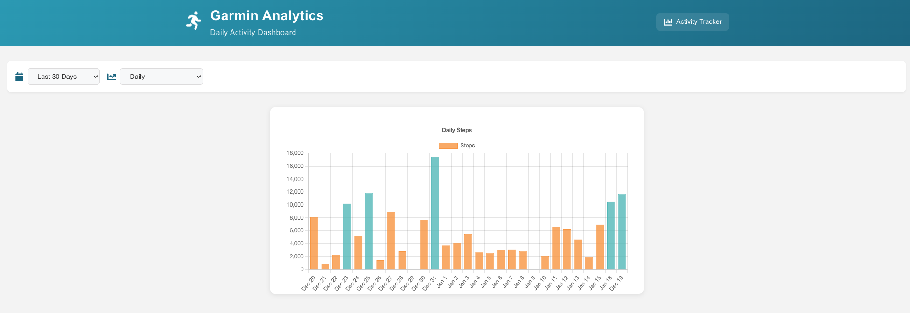

# Garmin Activity Dashboard

A containerized application that pulls data from Garmin Connect API, stores it in PostgreSQL, and displays it through a Next.js frontend.

## Overview

This project consists of three main components:
1. Data Pull Service: Fetches data from Garmin Connect API
2. PostgreSQL Database: Stores activity data
3. Frontend Dashboard: Visualizes the data using Next.js and Chart.js



## Architecture

The application is containerized using Docker and consists of three services:
- `data_pull`: Python service that authenticates with Garmin and pulls activity data
- `db`: PostgreSQL database for storing activity metrics
- `api`: Flask API service that provides endpoints for the frontend
- `frontend`: Next.js application that visualizes the data

## Prerequisites

- Docker and Docker Compose
- Garmin Connect Account
- Environment variables set up for Garmin authentication:
  - `GARMIN_EMAIL`
  - `GARMIN_PASSWORD`

## Setup

1. Clone the repository

2. Create environment variables:
   ```bash
   GARMIN_EMAIL=your_email
   GARMIN_PASSWORD=your_password
   ```

3. Start the Docker containers:
   ```bash
   docker-compose up -d
   ```

## Components

### Data Pull Service
- Python service using `garminconnect` library
- Authenticates with Garmin Connect
- Pulls daily activity data
- Stores data in PostgreSQL database

### Database
- PostgreSQL database
- Stores daily step data with schema:
  ```sql
  CREATE TABLE daily_steps (
    date TIMESTAMP,
    total_steps INTEGER,
    distance INTEGER,
    step_goal INTEGER
  );
  ```

### API Service
- Flask API providing endpoints for the frontend
- Endpoints:
  - GET `/daily_steps`: Returns step data with time period filtering

### Frontend
- Next.js application
- Features:
  - Interactive step count visualization using Chart.js
  - Time period selection (7 days, 14 days, 30 days, etc.)
  - Goal completion tracking
  - Responsive design

## Development

1. Run the development environment:
   ```bash
   # Start backend services
   docker-compose up -d

   # Start frontend development server
   cd garmin-frontend
   npm install
   npm run dev
   ```

2. Access the application:
   - Frontend: http://localhost:3000
   - API: http://localhost:5001

## Project Structure

```
├── backend/ # Flask API service
├── database/ # Database initialization
├── garmin_data_pull/ # Garmin data fetching service
├── garmin-frontend/ # Next.js frontend application
└── docker-compose.yaml # Docker composition file
```

## Technologies Used

- Backend:
  - Python
  - Flask
  - SQLAlchemy
  - garminconnect
- Frontend:
  - Next.js
  - TypeScript
  - Chart.js
  - Tailwind CSS
- Database:
  - PostgreSQL
- Infrastructure:
  - Docker
  - Docker Compose

## Contributing

1. Fork the repository
2. Create your feature branch
3. Commit your changes
4. Push to the branch
5. Create a new Pull Request